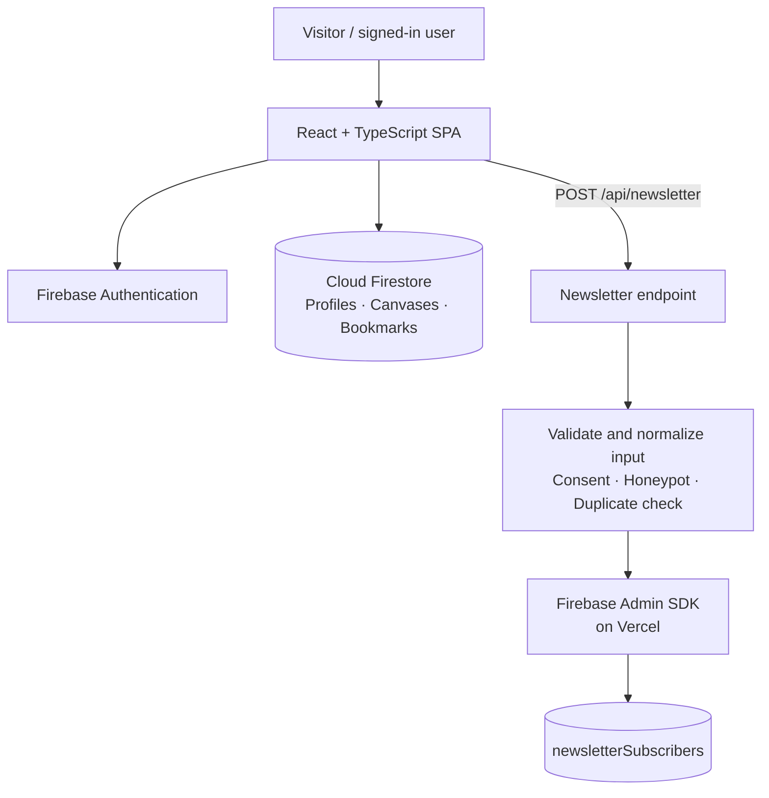

<div align="center">
  <a href="https://ospc-task-xi.vercel.app/">
    
  </a>

  <p><strong>A better question can change the way you lead.</strong></p>
  <p>An independent, interactive learning experience about purpose, trust and putting ideas into practice.</p>

  <p>
    <a href="https://ospc-task-xi.vercel.app/"><strong>Visit the live site ↗</strong></a>
    &nbsp;·&nbsp;
    <a href="https://github.com/ishanraychaudhuri2025/OSPC_task">Source code</a>
    &nbsp;·&nbsp;
    <a href="https://vercel.com/ishan-e93e/ospc-task/Gh8PMYbWUpTgwriV7S2Rnbmku4mg">Vercel project</a>
  </p>

  <p>
    
    
    
    
    
  </p>
</div>

---

## Contents

- [Overview](#overview)
- [Product experience](#product-experience)
- [Design direction](#design-direction)
- [How it works](#how-it-works)
- [Technology stack](#technology-stack)
- [Data model](#data-model)
- [Run locally](#run-locally)
- [Environment configuration](#environment-configuration)
- [Deploy to Vercel](#deploy-to-vercel)
- [Security notes](#security-notes)
- [Project structure](#project-structure)
- [Quality checks](#quality-checks)
- [Attribution and disclaimer](#attribution-and-disclaimer)

## Overview

**WHY, PRACTICED** is a full-stack, editorial-style web application inspired by publicly available ideas associated with Simon Sinek—especially purpose, the Golden Circle, leadership, trust and the infinite mindset.

The goal is to make those ideas more useful than a passive reading list. Visitors can explore curated topics, browse podcast references, work through an interactive purpose canvas, save their progress to an account, and optionally register interest in independent study notes.

This is an independent student project. It is not Simon Sinek's official website, and it is not affiliated with or endorsed by Simon Sinek or The Optimism Company.

## Product experience

| Route | Experience | What visitors can do |
| --- | --- | --- |
| `/` | **Home** | Explore the project's editorial premise and navigate to the main experiences. |
| `/ideas` | **Ideas Library** | Browse curated topic cards and use the available search/category filters to find relevant ideas and reflection prompts. |
| `/practice` | **Practice Lab** | Build a purpose canvas using **Why**, **How** and **What**, see the Golden Circle visual update, and save, edit or delete canvases while signed in. |
| `/podcast` | **Podcast Directory** | Explore a curated directory for *A Bit of Optimism*, search/filter episode cards, open external listening links and bookmark episodes when signed in. |
| `/dashboard` | **My Journey** | View and manage saved canvases and podcast bookmarks for the signed-in account. |
| `/auth` | **Account Access** | Create an account, sign in, reset a password and access available verification flows. Email/password and Google sign-in are supported when enabled in Firebase. |
| `/community` | **Notes on WHY** | Submit an opt-in form with email, optional name/topic interest and explicit consent. The server validates the submission and records it in Firestore. |

### Core capabilities

- **Persistent identity:** Firebase Authentication with a shared auth-state context and browser session persistence.
- **Personal workspace:** signed-in users can persist and manage their own purpose canvases.
- **Bookmarks:** save podcast episodes and retrieve them from the dashboard.
- **Real form submission:** the community form sends a `POST /api/newsletter` request; it is not just a client-side success message.
- **Validation and duplicate handling:** the newsletter endpoint normalizes and validates the email, requires consent, checks optional fields, includes a honeypot and uses a deterministic document ID for duplicate handling.
- **Responsive editorial UI:** warm paper tones, restrained terracotta accent, serif display typography, clear type hierarchy and a custom concentric-ring Golden Circle illustration.
- **Independent-project disclosure:** the footer makes the project's non-affiliation clear.

> **Newsletter MVP scope:** the form records an opt-in in the database. It does not send automated emails unless a separate email delivery service is added and configured.

## Design direction

The interface is built around a quiet, editorial visual system rather than a generic SaaS dashboard.

| Token | Value | Use |
| --- | --- | --- |
| Paper | `#F6F3EC` | Main page background |
| Ink | `#171B1B` | Primary text and strong controls |
| Surface | `#FFFEFA` | Cards and form surfaces |
| Divider | `#D8D8CF` | Rules and borders |
| Signal | `#D64B37` | Accent, active state and key highlights |
| Sage | `#DCE5D8` | Secondary visual emphasis and success states |

The layout emphasizes deliberate whitespace, readable line lengths, consistent components, restrained motion and keyboard-visible focus states.

## How it works

The browser handles the interface and Firebase client SDK flows. Newsletter submissions go to a server endpoint so validation and storage can be handled separately from the page UI.



### Runtime notes

- **Google AI Studio preview:** the platform-provided Firebase applet configuration can be used when available in that workspace.
- **GitHub/Vercel deployment:** the applet configuration file is intentionally not committed. The Vite frontend must use `VITE_FIREBASE_*` environment variables. The Vercel newsletter function uses the Firebase Admin SDK and server-only credentials.
- **Firestore database:** configure the exact database ID for this project. Do not assume the database is named `(default)`.

## Technology stack

| Layer | Technology | Responsibility |
| --- | --- | --- |
| UI | React 19 | Reusable page and component structure |
| Language | TypeScript | Typed application logic and data models |
| Build tooling | Vite | Development server and production frontend bundle |
| Styling | Tailwind CSS v4 + custom CSS | Responsive layout and editorial design system |
| Icons / motion | Lucide React, Motion | Interface icons and selected motion effects |
| Authentication | Firebase Authentication | Email/password and Google identity flows |
| Database | Cloud Firestore | User profiles, saved canvases, bookmarks and opt-in records |
| Server endpoint | Node.js / TypeScript | Newsletter validation and persistence |
| Production hosting | Vercel | Frontend hosting and `api/newsletter.ts` function |
| Source control | GitHub | Repository, version history and deployment integration |

## Data model

The application uses these Firestore paths:

| Path | Purpose |
| --- | --- |
| `users/{uid}` | User profile associated with the Firebase Authentication UID |
| `users/{uid}/canvases/{canvasId}` | User-owned Why / How / What purpose canvases |
| `users/{uid}/bookmarks/{bookmarkId}` | Podcast episode bookmarks |
| `newsletterSubscribers/{sha256(normalizedEmail)}` | Newsletter opt-in records keyed by a deterministic email hash |

The rules in [`firestore.rules`](firestore.rules) define client access. User-owned profile, canvas and bookmark paths are scoped by the authenticated UID. The newsletter endpoint also performs server-side input validation; remember that Firebase Admin SDK operations bypass Firestore Security Rules, so server-side validation and credential protection are essential.

## Run locally

### Prerequisites

- Node.js version supported by the installed Vite release (a current Node.js LTS release is recommended).
- npm.
- Access to the Firebase project used by the application.

### 1. Install dependencies

```bash
npm install
```

### 2. Configure local environment

Copy the example file and fill in the values for your own Firebase web app and server runtime:

**Windows PowerShell**
```powershell
Copy-Item .env.example .env
```

**macOS / Linux**
```bash
cp .env.example .env
```

The example contains variable names only. Add real values to your local `.env` file; that populated file must remain untracked by Git.

### 3. Start the development server

```bash
npm run dev
```

The Express + Vite middleware server defaults to **http://localhost:3000**.

### 4. Available scripts

| Command | Purpose |
| --- | --- |
| `npm run dev` | Start the Express server with Vite development middleware |
| `npm run lint` | Run the configured TypeScript check (`tsc --noEmit`) |
| `npm run build` | Build the production frontend into `dist/` |
| `npm run start` | Start the Node server in production mode |
| `npm run preview` | Preview the built frontend with Vite; use the Node server when testing the API locally |

## Environment configuration

Configure environment variables in **Vercel → Project → Settings → Environment Variables**. Values prefixed with `VITE_` are included in the frontend bundle at build time; use them only for public Firebase web-app configuration, never for private credentials.

### Frontend — required for a GitHub/Vercel build

| Variable | Description |
| --- | --- |
| `VITE_FIREBASE_API_KEY` | Firebase web app API key |
| `VITE_FIREBASE_AUTH_DOMAIN` | Firebase Authentication domain |
| `VITE_FIREBASE_PROJECT_ID` | Firebase project ID |
| `VITE_FIREBASE_STORAGE_BUCKET` | Firebase Storage bucket configured for the web app |
| `VITE_FIREBASE_MESSAGING_SENDER_ID` | Firebase messaging sender ID |
| `VITE_FIREBASE_APP_ID` | Firebase web app ID |
| `VITE_FIREBASE_DATABASE_ID` | Exact Firestore database ID used by the application |

### Server — required for the Vercel newsletter function

| Variable | Description |
| --- | --- |
| `FIREBASE_SERVICE_ACCOUNT_KEY` | Full service-account JSON stored as a server-only environment variable; preferred option |
| `FIREBASE_CLIENT_EMAIL` | Alternative service-account email, if using separate credential variables |
| `FIREBASE_PRIVATE_KEY` | Alternative service-account private key; server-only |
| `FIREBASE_PROJECT_ID` | Target Firebase project ID for the Admin SDK |
| `FIREBASE_DATABASE_ID` | Target Firestore database ID for the Admin SDK |

For the server configuration, use **either** `FIREBASE_SERVICE_ACCOUNT_KEY` **or** the pair `FIREBASE_CLIENT_EMAIL` + `FIREBASE_PRIVATE_KEY`. The project ID and database ID are also required.

**Never** commit a populated `.env` file, service-account JSON file, private key, or other privileged credential. Store production secrets in Vercel's environment-variable settings. Firebase browser configuration is public client configuration; restrict its allowed APIs and website usage appropriately in Google Cloud.

## Deploy to Vercel

The production site is hosted at **[ospc-task-xi.vercel.app](https://ospc-task-xi.vercel.app/)**.

To reproduce the deployment:

1. Import [`ishanraychaudhuri2025/OSPC_task`](https://github.com/ishanraychaudhuri2025/OSPC_task) into Vercel.
2. Use the Vite preset, `npm run build` as the build command, and `dist` as the output directory.
3. Add all required `VITE_FIREBASE_*` variables before building.
4. Add the server-only Firebase Admin variables needed by `api/newsletter.ts`.
5. Deploy and inspect the build logs if deployment fails.
6. In Firebase Authentication settings, add the deployed Vercel hostname under **Authorized domains** if sign-in flows require it.
7. Test the deployed routes directly, including refreshes on `/ideas`, `/practice`, `/podcast`, `/dashboard`, `/auth` and `/community`.
8. Submit a valid newsletter opt-in and confirm that a corresponding record exists in the intended Firestore database.

Every environment-variable change requires a new Vercel deployment to affect the built frontend.

## Security notes

- `firebase-applet-config.json` is generated by Google AI Studio when provisioned and is intentionally excluded from the GitHub repository. The app can use it in the supported preview workspace; Vercel relies on environment configuration.
- The Firebase web API key is not a Firebase Admin credential. It can appear in browser configuration, but it should be restricted to required Firebase APIs and the intended website origins.
- Service-account credentials must remain server-side and must never use a `VITE_` prefix.
- `.gitignore` excludes populated `.env*` files (except `.env.example`), generated applet configuration, private-key files and common service-account JSON filenames.
- Never log raw subscriber emails or return raw database exceptions to public clients.
- Review [`firestore.rules`](firestore.rules) whenever data paths or write behaviour change. Test access control with both authenticated and unauthenticated clients before treating a deployment as production-ready.

## Project structure

```text
.
├── api/
│   └── newsletter.ts          # Newsletter serverless endpoint
├── docs/
│   └── why-practiced-cover.svg
├── src/
│   ├── components/            # Header, footer and Golden Circle illustration
│   ├── context/               # Shared Firebase auth state
│   ├── data/                  # Curated ideas and podcast catalog
│   ├── lib/                   # Firebase initialization and user-data helpers
│   ├── pages/                 # Home, Ideas, Practice, Podcast, Dashboard, Auth, Community
│   ├── router/                # Lightweight client-side routing
│   ├── App.tsx
│   └── main.tsx
├── firestore.rules            # Firestore client access rules
├── server.ts                  # Express + Vite development/Node server
├── vercel.json                # Vercel SPA routing configuration
├── .env.example               # Environment variable names; no live values
└── package.json
```

## Quality checks

Before a release, run the available local checks:

```bash
npm run lint
npm run build
```

Then verify real interactions in the deployed site:

- [ ] Direct navigation and refresh work for every route.
- [ ] Sign up, sign in, sign out and password reset behave as expected.
- [ ] Authentication state is restored after a refresh.
- [ ] A saved purpose canvas remains available after signing out and signing back in.
- [ ] One account cannot access another account's private canvases or bookmarks.
- [ ] Podcast filters and bookmarks behave correctly.
- [ ] Newsletter validation, consent, duplicate handling and Firestore persistence work on the Vercel URL.
- [ ] No credentials are committed, and Firebase/Firestore access rules have been reviewed.
- [ ] Run Lighthouse for performance, accessibility, best practices and SEO; run any Watchtower report specifically required by the evaluator.

Do not treat a successful frontend build as proof that Firebase, authentication, serverless functions or database writes have been verified. Confirm those against the deployed app.

## Attribution and disclaimer

This project is an independent student-built experience informed by publicly available ideas associated with Simon Sinek. It does not represent Simon Sinek or The Optimism Company, and it should not be interpreted as an official product.

- [Simon Sinek — Official website](https://simonsinek.com/)
- [Our WHY](https://simonsinek.com/our-why/)
- [Official books catalogue](https://simonsinek.com/books)
- [Start with Why](https://simonsinek.com/books/start-with-why)

The podcast directory is a curated navigation experience that points visitors toward external listening destinations; podcast names and marks belong to their respective owners. This project does not claim ownership of the referenced content.

---

<div align="center">
  <sub>Built with care around a simple idea: purpose matters most when it changes what we practice.</sub>
</div>
